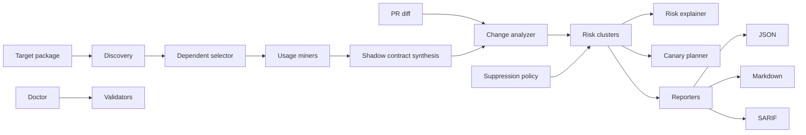

# Architecture

HyrumGuard's stable local release is a CLI pipeline. It avoids hosted state and keeps every artifact commit-friendly.

The public release repository is `https://github.com/BoSuY0/HyrumGuard`.

## Components

- `hyrumguard.discovery`: combines manual seeds with ecosyste.ms package dependent data.
- `hyrumguard.miners`: mines Python and JavaScript/TypeScript source files.
- `hyrumguard.synthesis`: groups contract atoms into `shadow-contracts.lock.json`.
- `hyrumguard.diff`: parses git or unified diff data into changed subjects.
- `hyrumguard.analysis`: matches changed subjects to shadow contracts.
- `hyrumguard.suppressions`: marks accepted risks without dropping audit evidence.
- `hyrumguard.explain`: renders targeted risk evidence from an existing risk artifact.
- `hyrumguard.canary`: plans or executes changed-only downstream checks.
- `hyrumguard.reporters`: renders risk output as JSON, Markdown, and SARIF.
- `hyrumguard.config`: loads config and provides the starter config used by `hyrumguard init`.
- `hyrumguard.doctor`: wraps existing validators into a local readiness report.
- `hyrumguard.cli`: exposes the product flow.

## Data Flow

1. Optional initialization writes `.hyrumguard.yml`.
2. Discovery writes `.hyrum/dependents.json`.
3. Inference writes `.hyrum/shadow-contracts.lock.json`.
4. Check writes `.hyrum/risks.json`, optionally marking config-suppressed findings.
5. Explain can render focused Markdown/JSON for selected risks by id or subject.
6. Report writes Markdown/SARIF/JSON artifacts.
7. Canary writes `.hyrum/canary.json` from active unsuppressed risks by default.
8. Doctor can check selected config/artifact paths and render local diagnostics.

## Design Boundaries

The implementation is analysis-first. It prioritizes explainable evidence and deterministic files over broad ecosystem coverage. Doctor and explain commands read local artifacts only. Hosted PR comments, GitHub App state, GitLab App state, and hard sandbox orchestration are future work.
