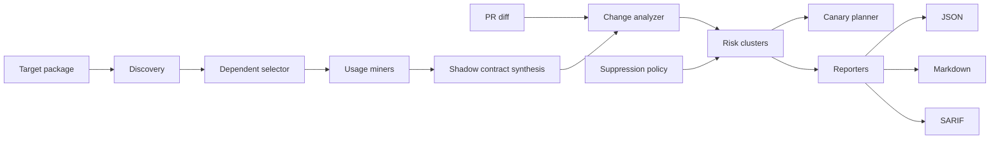

# Architecture

HyrumGuard's stable local release is a CLI pipeline. It avoids hosted state and keeps every artifact commit-friendly.

The public release repository is `https://github.com/BoSuY0/HyrumGuard`.

## Components

- `hyrumguard.discovery`: combines manual seeds with ecosyste.ms package dependent data.
- `hyrumguard.miners`: mines Python and JavaScript/TypeScript source files.
- `hyrumguard.synthesis`: groups contract atoms into `shadow-contracts.lock.json`.
- `hyrumguard.diff`: parses git or unified diff data into changed subjects.
- `hyrumguard.analysis`: matches changed subjects to shadow contracts.
- `hyrumguard.suppressions`: marks accepted risks without dropping audit evidence.
- `hyrumguard.canary`: plans or executes changed-only downstream checks.
- `hyrumguard.reporters`: renders risk output as JSON, Markdown, and SARIF.
- `hyrumguard.cli`: exposes the product flow.

## Data Flow

1. Discovery writes `.hyrum/dependents.json`.
2. Inference writes `.hyrum/shadow-contracts.lock.json`.
3. Check writes `.hyrum/risks.json`, optionally marking config-suppressed findings.
4. Report writes Markdown/SARIF/JSON artifacts.
5. Canary writes `.hyrum/canary.json` from active unsuppressed risks by default.

## Design Boundaries

The implementation is analysis-first. It prioritizes explainable evidence and deterministic files over broad ecosystem coverage. Hosted PR comments, GitHub App state, GitLab App state, and hard sandbox orchestration are future work.
